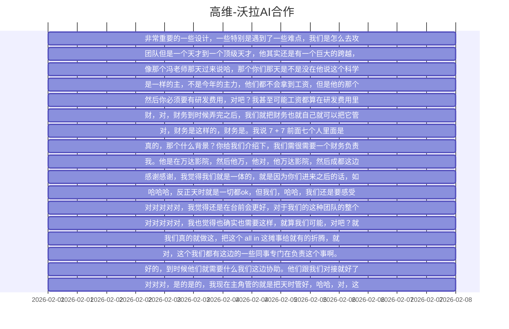

```mermaid
gantt
    title 高维-沃拉AI合作
    dateFormat YYYY-MM-DD
    
    非常重要的一些设计，一些特别是遇到了一些难点，我们是怎么去攻 :task_1000, 2026-02-01, 2026-02-08
    团队但是一个天才到一个顶级天才，他其实还是有一个巨大的跨越， :task_1001, 2026-02-01, 2026-02-08
    像那个冯老师那天过来说哈，那个你们那天是不是没在他说这个科学 :task_1002, 2026-02-01, 2026-02-08
    是一样的主，不是今年的主力，他们都不会拿到工资，但是他的那个 :task_1003, 2026-02-01, 2026-02-08
    然后你必须要有研发费用，对吧？我甚至可能工资都算在研发费用里 :task_1004, 2026-02-01, 2026-02-08
    财，对，财务到时候弄完之后，我们就把财务也就自己就可以把它管 :task_1005, 2026-02-01, 2026-02-08
    对，财务是这样的，财务是。我说 7 + 7 前面七个人里面是 :task_1006, 2026-02-01, 2026-02-08
    真的，那个什么背景？你给我们介绍下，我们需很需要一个财务负责 :task_1007, 2026-02-01, 2026-02-08
    我。他是在万达影院，然后他万，他对，他万达影院，然后成都这边 :task_1008, 2026-02-01, 2026-02-08
    感谢感谢，我觉得我们就是一体的，就是因为你们进来之后的话，如 :task_1009, 2026-02-01, 2026-02-08
    哈哈哈，反正天时就是一切都ok，但我们，哈哈，我们还是要感受 :task_1010, 2026-02-01, 2026-02-08
    对对对对对，我觉得还是在台前会更好，对于我们的这种团队的整个 :task_1011, 2026-02-01, 2026-02-08
    对对对对对，我也觉得也确实也需要这样，就算我们可能，对吧？就 :task_1012, 2026-02-01, 2026-02-08
    我们真的就做这，把这个 all in 这摊事给就有的折腾，就 :task_1013, 2026-02-01, 2026-02-08
    对，这个我们都有这边的一些同事专门在负责这个事啊。 :task_1014, 2026-02-01, 2026-02-08
    好的，到时候他们就需要什么我们这边协助。他们跟我们对接就好了 :task_1015, 2026-02-01, 2026-02-08
    对对对，是的是的，我现在主角管的就是把天时管好，哈哈，对，这 :task_1016, 2026-02-01, 2026-02-08
```
