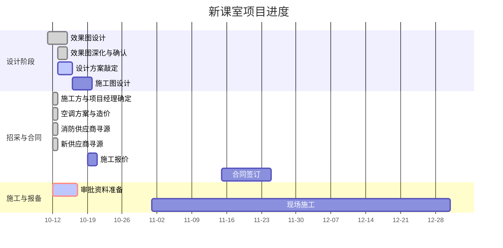

# 新课室 项目计划

## 项目甘特图

## 相关链接

- [新课室项目资料](https://hcny11iw8rzv.feishu.cn/wiki/XjT8wIFDKiBMcvkIABMc1W7gn2p)

## 项目概述
简述项目目标与目标用户（空间改造、设备系统、教学应用）。

## 项目目标
- 短期目标：
- 中长期目标：

## 范围与交付物
- 交付物清单：
- 非目标范围：

## 时间线与里程碑
| 里程碑 | 计划日期 | 实际日期 | 状态 | 负责人 | 备注 |
| --- | --- | --- | --- | --- | --- |
| 方案设计评审 |  |  | 计划中 |  |  |
| 设备/施工招采 |  |  | 计划中 |  |  |
| 装修与布线完成 |  |  | 计划中 |  |  |
| 试运行与验收 |  |  | 计划中 |  |  |
| 效果图出图 | 2025-10-15 |  | 计划中 |  | 周三出图，确认后进入施工图 |
| 施工图完成 | 2025-10-19 |  | 计划中 |  | 施工图周期4天 |
| 我方报价完成 | 2025-10-21 |  | 计划中 |  | 施工图完成后2天报价 |
| 合同起租 | 2025-11-01 |  | 计划中 |  | 报备需跟上 |

## 关键进度
| 日期 | 进度内容 | 状态 | 关联里程碑 | 负责人 | 备注 |
| --- | --- | --- | --- | --- | --- |
| 2025-10-12 | 敲定肖晓为项目经理（工期2个月，费用4万） | 已完成 | 设备/施工招采 | 肖晓 |  |
| 2025-10-12 | 空调方案确定：从T1拉8cm冷水管 | 已完成 | 方案设计评审 |  | 造价待询 |
| 2025-10-12 | 约好与设计公司过深化效果图 | 进行中 | 方案设计评审 |  |  |
| 2025-10-12 | 合同谈判：甲方反馈条款无法修改 | 进行中 | 合同起租 |  |  |
| 2025-10-12 | 获取消防供应商“杨景” | 已完成 | 设备/施工招采 |  |  |
| 2025-10-12 | 获知业主和物业方审核资料清单 | 已完成 | 报备 |  |  |
| 2025-10-12 | 考察LED厂商、小度（智能+弱电）厂商、设计公司 | 已完成 | 设备/施工招采 |  | 厂商拜访 |
| 2025-10-12 | 暂不改管，只交表显流量费 | 进行中 | 方案设计评审 |  | 空调方案变更 |
| 2025-10-12 | 进场延期至11月15日 | 计划中 | 合同起租 |  | 进度调整 |
| 2025-10-12 | 周日前敲定设计方案，设计公司进入深化阶段 | 计划中 | 方案设计评审 |  | 设计进度 |
| 2025-10-11 | 模型已建好；周三可出效果图；确认后进入施工图（4天） | 计划中 | 效果图出图 |  |  |
| 2025-10-11 | 施工图完成后2天内我方报价；你方可进行报价对比 | 计划中 | 我方报价完成 |  | 推导日期已加入 |
| 2025-10-11 | 已发信息给依纯与军哥，同步品牌与案例设计 | 进行中 | 方案设计评审 |  |  |
| 2025-10-11 | 家具供应商已确定；与大眼沟通其来对接；下周一拉群 | 计划中 | 设备/施工招采 |  | 预计2025-10-13拉群 |

## 关键决策
| 日期 | 主题 | 选项 | 结论 | 影响范围 | 决策人 | 备注 |
| --- | --- | --- | --- | --- | --- | --- |
| 2025-10-12 | 项目经理任命 | - | 肖晓 | 现场管理效率 |  |  |
| 2025-10-12 | 空调方案选定 | - | 暂不改管，只交表显流量费 | 成本与施工配合 |  |  |
| 2025-10-11 | 空调安装方式 | 承包商安装 / 自装 | 自装 | 成本与施工配合 |  | 高度问题明天科兴考察 |
| 2025-10-11 | 是否邀请肖晓盯现场 | 邀请 / 不邀请 | 待定 | 现场管理效率 |  | 待定 |

## 风险与卡点
| 描述 | 影响 | 优先级 | 负责人 | 计划解决时间 | 状态 | 应对措施 |
| --- | --- | --- | --- | --- | --- | --- |
| 报备时间紧（合同11月1日起租） | 起租与施工节奏 | 高 |  |  | 进行中 | 倒排计划，提前准备报备材料 |
| 合同条款固化，无法修改 | 合作风险 | 中 |  |  | 进行中 | 评估合同中的潜在风险点 |

## 关键联系人
| 姓名 | 角色 | 单位 | 联系方式 | 备注 |
| --- | --- | --- | --- | --- |
| 肖晓 | 项目经理 | - | - | 负责现场施工 |
| 杨景 | 消防供应商 | - | - |  |
| 陈敏 | 课室椅子供应商 | 坐感科技 | - |  |
| 张总 | LED供应商 | 领灿科技 | - |  |
| 叶总 | 板材供应商 | 朗生 | - |  |
| 钟总 | 设计师 | 设计公司 | - | 主要对接人 |

## 交付物清单

| 交付物名称 | 交付标准 | 计划交付日期 | 负责人 | 状态 |
| --- | --- | --- | --- | --- |
| 全套设计图纸（CAD与蓝图） | 包含下方“图纸要求”中的所有图纸 | | | 待收集 |

### 图纸要求

- [ ] 客户准备的图纸必须有中文施工说明、设计及装修施工单位图签
- [ ] 所有报批图纸均应为设计蓝图且应装订入档案盒内
- [ ] 另需提供电子版CAD图
- [ ] **图纸内容**
-   - [ ] 原始平面图
-   - [ ] 装修平面图
-   - [ ] 天花平面图
-   - [ ] 电气平面图
-   - [ ] 智能化平面图
-   - [ ] 给排水平面图
-   - [ ] 分散设备荷载设计图（如有超重设备）
-   - [ ] 消防系统平面图
-   - [ ] 空调系统平面图
-   - [ ] 防排烟系统平面图
-   - [ ] 隐蔽工程线路图
-   - [ ] 防水平面图（含防水节点图）
-   - [ ] 外立面图及效果图（商业客户需提供，需包含商铺招牌相关内容）
-   - [ ] 隔油池及排烟管道设计图（餐饮商业客户需提供）
-   - [ ] 装修材料清单及施工工艺以及装修材料的防火阻燃检测报告和环保检测报告
-   - [ ] 以上所有图纸的设计说明及系统图
-   - [ ] 其他

## 待办清单
| 优先级 | 事项 | 负责人 | 截止日期 | 状态 |
| --- | --- | --- | --- | --- |
| 高 | 跟进空调拉管工程造价 | | | 待办 |
| 高 | 准备明天与设计公司会议的决策需求清单 | | 2025-10-13 | 待办 |
| 高 | 去设计公司过效果图 | | 2025-10-13 | 待办 |
| 高 | 看一家装修公司 | | 2025-10-13 | 待办 |
| 高 | 与律师通话（评估合同风险） | | 2025-10-13 | 待办 |
| 中 | 梳理业主和物业方的详细审批资料 | | | 待办 |
| 低 | 评估合同中的潜在风险点 | | | 待办 |

## 对外沟通
| 日期 | 沟通对象 | 沟通渠道 | 主题 | 结论/待办 |
| --- | --- | --- | --- | --- |
| 2025-10-12 | 甲方 | - | 合同责任条款 | 对方表示无法修改 |
| 2025-10-12 | LED厂商 | 现场拜访 | 考察 | 了解产品与方案 |
| 2025-10-12 | 小度（智能+弱电） | 现场拜访 | 考察 | 了解产品与方案 |
| 2025-10-12 | 设计公司 | 现场拜访 | 考察 | 了解设计能力与配合模式 |
| 2025-10-11 | 设计公司 | 微信 | 确认效果图与施工图交付时间 | 效果图周三（15日）出，施工图19日完成 |